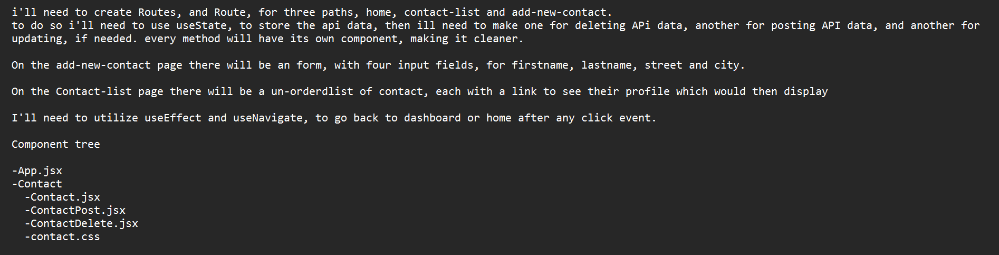

i'll need to create Routes, and Route, for three paths, home, contact-list and add-new-contact.
to do so i'll need to use useState, to store the api data, then ill need to make one for deleting APi data, another for posting API data, and another for updating, if needed. every method will have its own component, making it cleaner.

On the add-new-contact page there will be an form, with four input fields, for firstname, lastname, street and city. 

On the Contact-list page there will be a un-orderdlist of contact, each with a link to see their profile which would then display 

I'll need to utilize useEffect and useNavigate, to go back to dashboard or home after any click event.

I also used Link to route to edit page, and profile page, for deleting i used a simple button. all of them utilized the id of the contact to, either through useParams or by directly passing them in.

Component tree

-App.jsx
-Component
-Contact.jsx
-ContactListItem.jsx
-ContactCreate.jsx
-ContactEdit.jsx
.
