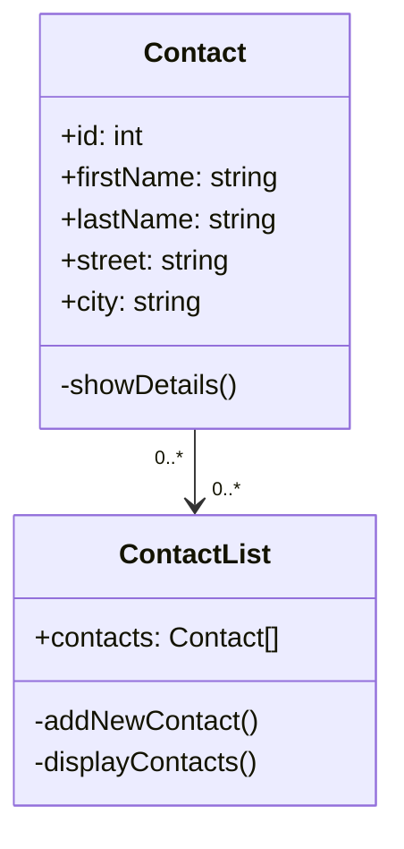

```mermaid
classDiagram
    class Contact {
        +id: int
        +firstName: string
        +lastName: string
        +street: string
        +city: string
        -showDetails()
    }
    class ContactList {
        -addNewContact()
        -displayContacts()
        +contacts: Contact[]
    }
    Contact "0..*" --> "0..*" ContactList
```