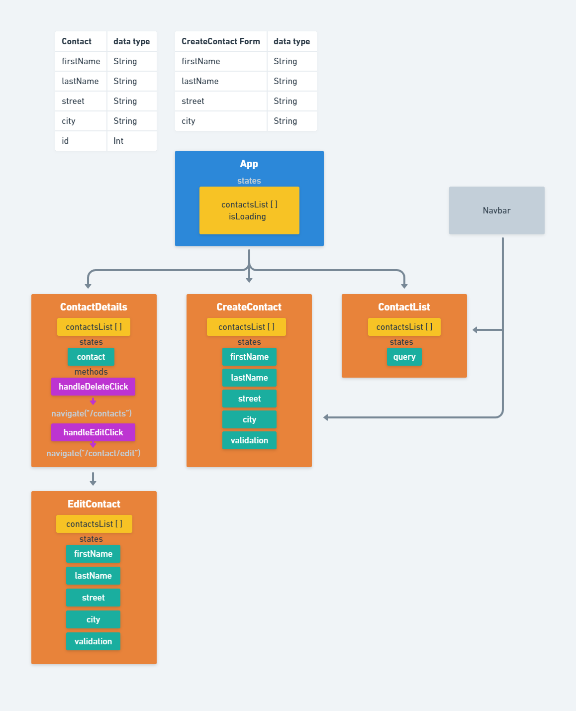

# Address Book
## App
A user can view all contacts in the `ContactList`, view a single contact in `Contact`, and insert a new contact or edit an exisiting contact in `ContactEditor`. `App` is the root component and is connected to a server backend, which stores the list of user contacts.
___
### ContactList
This is the main page of the application where a table of contacts is displayed.
##### ContactListCard
Each contact in `ContactList` is represented by a contact card which shows the most essential information about that contact:
* First name
* Last name
* Job title
* Email
### Contact
An overview of a single contact. Displays all available information about that contact.
### ContactEditor
This allows a user to create a new contact or to edit an existing one.

## Objects
### Contact

| Property        | Type    |
|-----------------|---------|
| id              | number  |
| firstName       | string  |
| lastName        | string  |
| street          | string  |
| city            | string  |
| gender          | string  |
| email           | string  |
| jobTitle        | string  |
| latitude        | number  |
| longitude       | number  |
| favouriteColour | string  |
| profileImage    | string  |

### Contacts
Array of `Contact`-objects.
